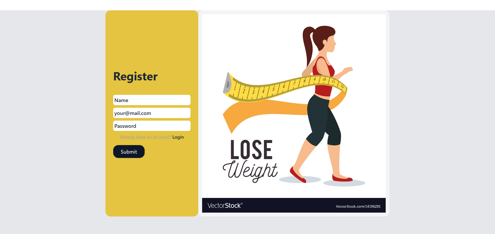
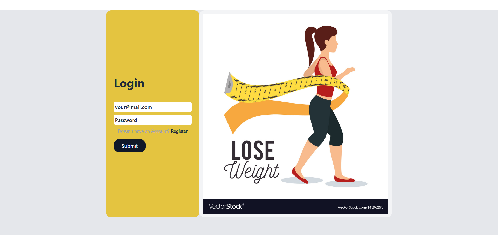
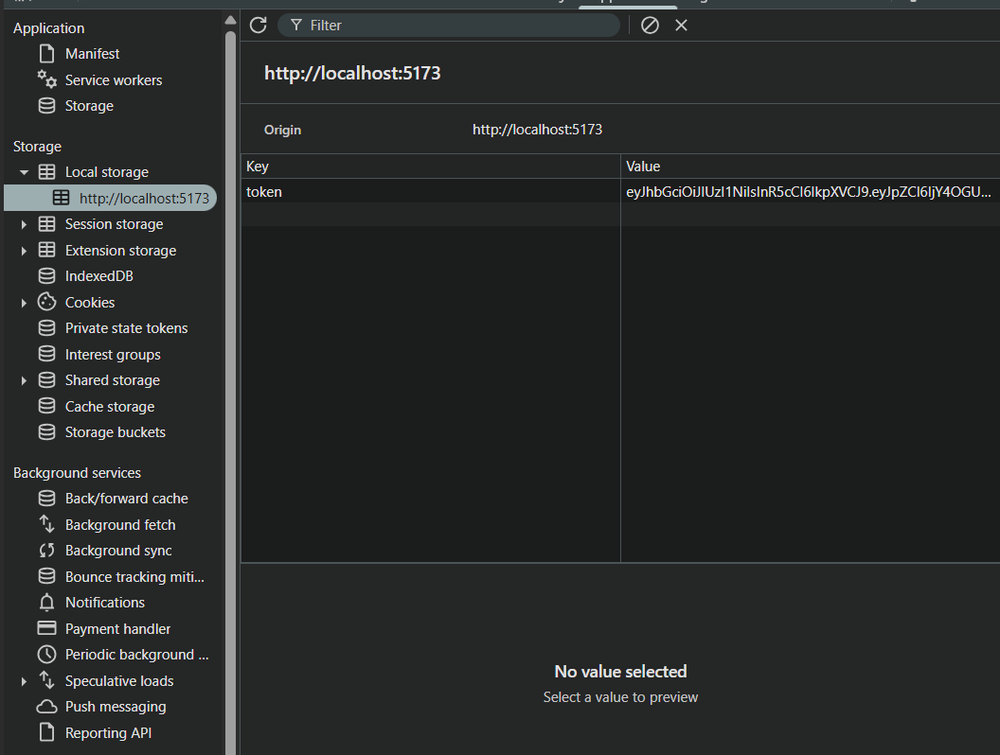
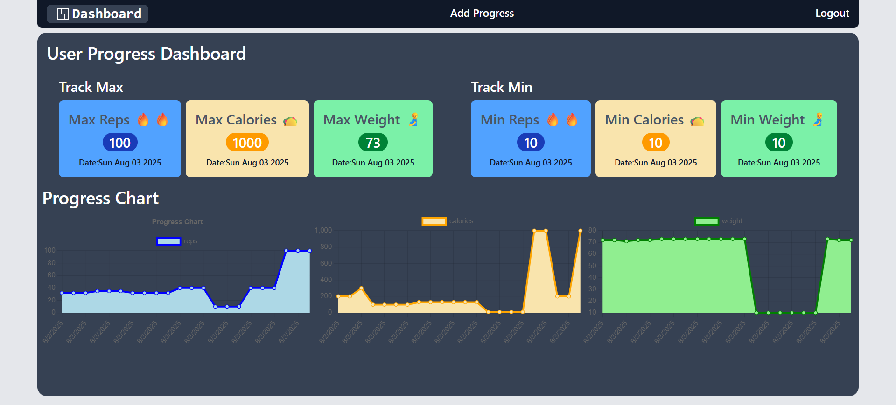
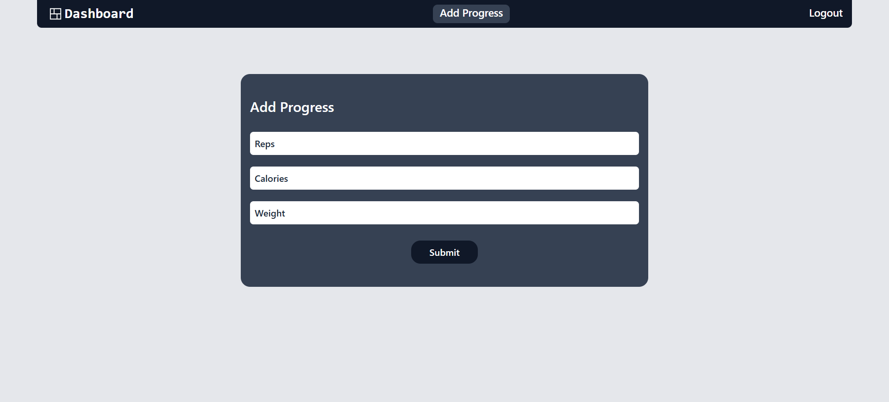
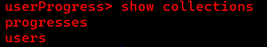
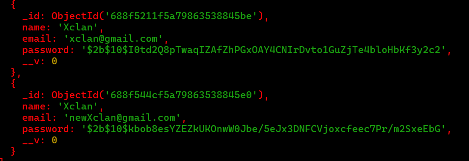
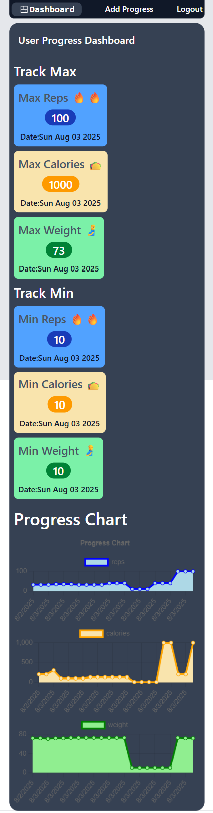
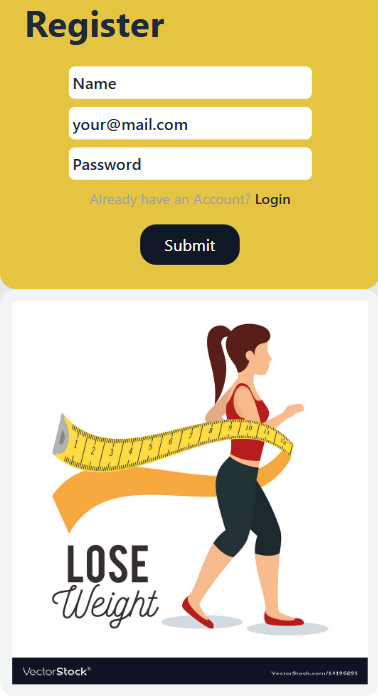

# User Progress App
###### Note: I didn't host the backend so tell me to run the server
##### For tracking reps, calories and weight

## FrontEnd Summerization

### First in this app you login or register your email address:

### then it will generate token in backend using Json web token

##### **the app will use this token to prevent user from navigating to home page unless he is signup or prevent uesr from go back to login page**

### Then the home page (Dashboard):

##### **in there your status will be tracked like weight, reps and calories and give you status diagram.**

### then you have add progress page where you add your status:

##### and when you click in logout buttom you will clear the token from localstorage and the app will force you to login page.

## BackEnd Summarization:

### we have four routers

#### first one for registeration :

**in this router we check validation of req.body and make sure the user provide his name, email and password , we validate that the password is exceed 8 charachter and the email is valid email when the user register a token will be generated and pass as a response to front end and hash password using bcrypt and save it to database**

#### second router for login:

**it's like registeration but instead of checking we compare hashed password to the one user provided and then if is matched he will logged in and pass token in response**

#### the third is for posting in dashboard:

**there is a middle ware in this and the fourth router to check if the user provide token which has userId (which is assign progress to that specific user) and then take reps, calories and weight from addProgress page**

#### the fourth router is get all data assign to this user:

**in middle ware check the token that passed with the request and verify it by verifying it it has userId because it is the unique key that defines that data belong to this user and after that pass userId in req.body to dashbord controller and add reps, calories, weight and userId that provided from token.**

## Database summarization:

### we have two database:

#### on for the User:

**which has name, email (uniq), password and id which will be passed to token**

#### the other one for progress:

**which has reps, calories, password , its id and userId which refers to user id**

### Responsive Pages:

